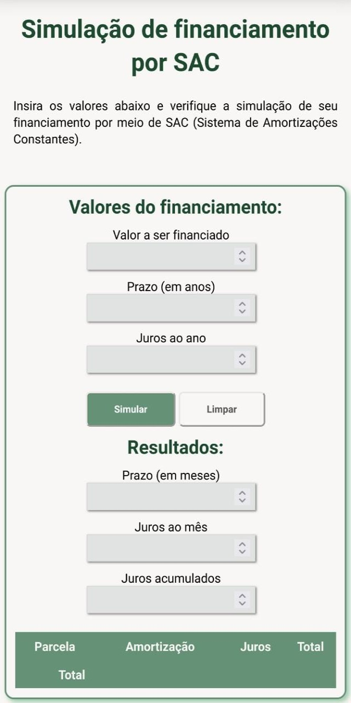
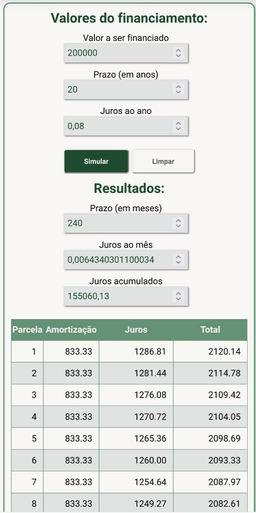
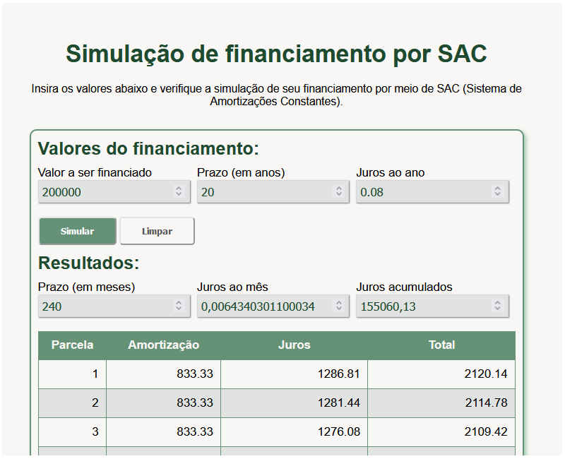

# Simulador de financiamento por SAC

    

<h4 align="center"> 
	🚧  Simulação - Em construção 🚧
</h4>

## Sobre a aplicação

A aplicação disponibilizada nesse repositório foi desenvolvida para o bootcamp Bootcamp Speed Wiz Dev realizado pelo [Instituto de Gestão e Tecnologia da Informação (IGTI)](https://www.igti.com.br/).

#### Enunciado:

>Construa, utilizando HTML, CSS e JavaScript, uma página para simulação de um financiamento com base nos dados fornecidos, exibindo o valor das primeiras prestações, de acordo com o Sistema de Amortizações Constantes (SAC).

## Link

O projeto desenvolvido pode ser acessado por [aqui](https://simulacao-sac-szpbl.netlify.app).

## Em dispositivos móveis:

  

  

## No browser:

  

## Tecnologias e ferramentas utilizadas

 - HTML5
 - CSS3
 - JavaScript

## Autor
---

 

Feito por Pablo Souza. 
Entre em contato:

 

